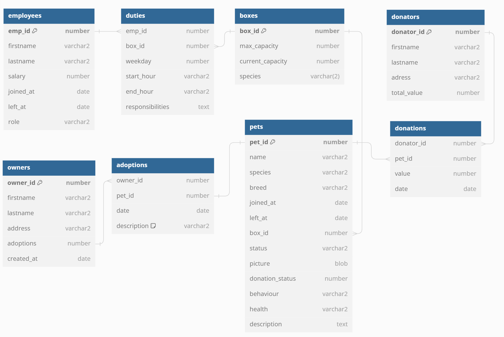

# animal-shelter-db

   

Objective data base project of animal shelter.

## Requirements

- JDK 11.0.18
- Oracle 19c

## Relation Diagram

     

## Execution sequence

1. Run `clear_database.sql` to remove named objects.
2. Run `objects.sql` to create types, tables and sequences.
3. Run `records.sql` to fill tables with basic records.
4. Run packets in any order.